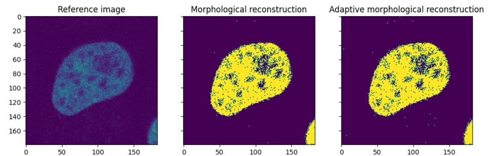

# Адаптивна морфологична реконструкция на изображения


## Съдържание

[Увод 2](#увод)

[Основни морфологични операции 2](#основни-морфологични-операции)

[Морфологична реконструкция 4](#морфологична-реконструкция)

[Недостатъци 4](#недостатъци)

[Предложение за адаптивност като решение
4](#предложение-за-адаптивност-като-решение)

[Подход за реализация 5](#подход-за-реализация)

[Резултати 5](#резултати)

[Странична бележка 5](#странична-бележка)

[Ресурси 5](#ресурси)

## Увод

Морфологичните трансформации се базират на работа с формите в изображения и като такива, помагат за постигане на резултати, свързани с откриване на конкретни форми, възстановяване и реконструиране на изображения. С помощта на простите операции като ерозия и дилатация и тяхното комбиниране се постигат различни резултати в областта на обработка на изображения. Това, на което по-подробно ще се спрем тук е именно сложната операция морфологична реконструкция, какви са нейните недостатъци и как да бъде подобрена, т.е. направена адаптивна. Един недостатък на морфологичната трансформация е че, понякога може да филтрира като излишни важни за даден алгоритъм локални минимуми и максимуми. Адаптивната реконструкция би се справяла по-добре с това понеже адаптивно филтрира ненужните сийд-ове докато запазва важните.

## Основни морфологични операции

Морфологичните операции, които ще разгледаме накратко са ни нужни за
извършването на морфологична реконструкция.

Oпределението за морфологични оператори съкратено представлява:

Морфологичните оператори са нелинейни оператори за съседство, дефинирано
от структурен елемент. Структурния елемент съдържа стойности 0 или 1 в
зависимост дали ще бъде включен или не даден пискел. Чрез проверка дали
структурният елемент съответства или не на обекти, разглеждани като
множество в n-мерното пространство се прилага обединение и/или сечение
на множествата и оператори за максимум и минимум. [\[1\]](#ресурси)

Дилатацията (dilation) е операция, която експандира обекти в дадено
изображение, като ако има поне един пиксел от обекта (foreground-a), то
всички други пиксели в съседството му също стават от обекта. Така може 2
обекта да се свържат.


Където A - множеството точки пиксели на стартовото изображение и B -
множеството точки пиксели на структурния елемент са от Z^2 z-тата
- стойностите на предните пиксели (1-ци)и всички елементи на B през z се
пресичат с поне един елемент на А.

Съответно ерозията (erosion) е операция, която „смалява" обекти, като за
всеки пиксел от обекта се определя дали да отиде към фона ако някой друг
пискел в съседството му е от фона. Така може 2 обекта да се разделят.
[\[4\]](#ресурси)


Където A - множеството точки пиксели на стартовото изображение и B -
множеството точки пиксели на структурния елемент са от Z^2, z-тата
са стойностите на предните пиксели (1-ци). Т.е. ерозията на А по B се
състои от всички точки z, за които B през z се съдържа в A.

Геодезичната дилатация и ерозия се дефинират, като вече имаме 2 входни
изображения. Маркер F, който задава стартовите точки на които се прилага
дилатация и Маска G, която ограничава трансфoрмацията. Отново имаме
структурен Елемент B. Дефинираме рекурсивно геодезичната дилатация:

$$D_{G}^{(1)}(F) = (F\bigoplus B)\bigcap G$$

$$D_{G}^{(n)}(F) = D_{G}^{(1)}\left\lbrack D_{G}^{(n - 1)}F \right\rbrack$$

$$D_{G}^{(0)}(F) = F$$


За геодезичната ерозия имаме подобна дефиниция, като разликата е че не
използваме дилатация а ерозия върху F към B и вместо сечение се прилага
обединение:

$$E_{G}^{(1)}(F) = (F \circleddash B)\bigcup G$$

$$E_{G}^{(n)}(F) = E_{G}^{(1)}\left\lbrack E_{G}^{(n - 1)}F \right\rbrack$$

$$E_{G}^{(0)}(F) = F$$


## Морфологична реконструкция

Ако започнем със същите начални условия - маркер изображение, маска и
структурен елемент, морфологичната реконструкция всъщност представлява
прогресивна дилатация (ако е дилатационна реконструкцията, aко e ерозионна е същото, само че с ерозия) на
маркер изображението, докато се ограничава маркера да не надвишава
стойностите на маската. Дилатацията се повтаря итеративно докато маркера
вече не може да се променя повече без да надвиши маската - стабилизира
се. Изходът от операцията е новополученото маркер изображение.

$$R_{G}^{D}(F) = D_{G}^{(k)}F$$

Сама по себе си тя има много приложения в различни алгоритми като
например watershed transform and power watershed тъй като помага за
филтрирането на локални екстремуми за да редуцира over-segmentation.
Използва се също в Hysteresis thresholding за определяне на истински
ръбове с помощта на 2 граници -- ниска и висока. Съответно с това, може
да се използва за Border-Clearing.

## Недостатъци

Проблем на обикновената морфолгична реконструкция е, че се задава един
предефиниран структурен елемент, който се прилага към всички точки от
маркера с първоначално определен размер. Така може на места да се получи
прекалена сегментация, при опит да се разграничат с висока точност
сегментите. Това е така, понеже е трудно едновременно да се премахнат
излишни регионални минимуми докато се запазват значещи такива, като се
има предвид структурен елемент от единствен мащаб.

## Предложение за адаптивност като решение

Решението на този проблем логически идва в промяната при определяне на
структурния елемент. Дефинирайки го на ниво пиксел, реконструкцията
става адаптивна. Различни начини за определяне на структурния елемент са
изследвани в последните години в научни трудове, тук ще се спрем на
един от тях.

Като решение което ще изпробваме е да се създава адаптивно структурен
елемент на базата на Adaptive Neighborhoods. Концепцията е базирана на
адаптивни съседства - колко голямо е съседството на даден пиксел на
базата на някаква предварителна евристика.

За да дадем по-добра дефиниция, при адаптивното съседство, на базата на
дадена евристична функция h, и допустимо отклонение m\>0, за всяка точка
x ot E - множеството от точките на изображението, адаптивното съседство
$V_{m}^{h}(x)$ съдържа всички точки y отговарящи спрямо евристиката на
$\left| h(y) - h(x) \right| \leq m$ които са свързани.

Тук, размерите (и формата, но в тази работа не се спираме на това) на
структурните елементи могат да варират от пиксел на пиксел и точно на
това се гради и имплементацията на адаптивна реконструкция която
постигнах в тази курсова работа.

## Подход за реализация

За да се провери разликата между обикновена морфологична реконструкция и
адаптивна с различни по размер структурни елементи, реализирах и двете и
ги тествах на едни и същи изображения с еднакви входни данни. При
създаването сложих един базов случай с матрица 10х9 с примера за
дилатация споменат по-горе, за да проверя че и двата алгоритъма работят
валидно.

Методът
```morphological_reconstruct(marker: np.ndarray, mask: np.ndarray, radius: int = 1)```

Изполва стандартния метод ```cv2.dilate(src=marker, kernel=kernel)``` за
итеративното експандиране до достигане на насищане, като на всяка
итерация се подава маркер изображението и предварително сетнат
структурен елемент (3х3) в случая на dilate, и после се прилага
```cv2.bitwise_and``` на експандираното и маската.

За имплементацията на 
```adaptive_morphological_reconstruct(marker: np.ndarray, mask: np.ndarray)```,

Реализирах custom имплементация на геодезичната дилатация, която да
работи не с предварително зададен елемент с радиус, а за всеки пиксел от
изображението, да проверява съседите му в радиус r, който определяме по
зададения критерии за адаптивност. Критерият, на който се спрях е otsu's
thresholding [\[8\]](#ресурси). На кратко казано, той се използва за
определяне на граничната стойност на пикселите, която определя дали даден пиксел е
към background-a или към foreground-a. Идеята е, че така до някаква
степен, ще се разделят пикселите, които са към фона и за тях ще бъде
прилаган по-голям радиус на съседство, докато за пикселите от обекта ще
бъде прилаган по-малък, за да не се изпуснат детайли по време на
разпознаването.

И на двата алгоритъма се подаваха едно и също изображение и еднакво
генерирана маска. Подробни коментари за избора на маската има в кода към
работата.

## Резултати

За базовия случай, и двата алгоритъма се представиха напълно идентично:


Когато вече го изтествах върху изображения с по-големи размерности
(180х183), (300х300), резултатите започнаха да изглеждат доста
по-различни:




Разликата между адаптивния и неадаптивния подход очевидно се вижда в по-добро запълване на регионите. При достатъчно подробна маска,
реконструираното изображение изглежда доста обещаващо. Нещо, което
срещнах като проблем беше именно, задаването на маската на
изображението. Първият вариант който видях и реших да приложа беше
следния:

mask = np.copy(image)

mask\[1:-1, 1:-1\] = image.max()

Оказа се обаче, че когато се вземат максималните стойности на всеки от
пикселите при нормалната реконструкция, образът изцяло blow out-va,
а адаптивната реконструкция се справяше донякъде.

В крайна сметка, подхода който избрах беше, на базата на референтното
изображение да правя маската, като ако пикселът е със стойност по-висока
от дадена константа да го добавям към маската със стойността му в
оригиналното изображение.

## Странична бележка 

Случайно докато подготвях тази курсова работа ми попадна видео на
реконструиран запис на първата [записана битка със снежни
топки](https://www.youtube.com/watch?v=AjToVdbPxbw&ab_channel=OldenDays).
За нея е използван алгоритъм базиран на GAN training - Generative
adversarial networks. Там реализацията е с помощта на невронни мрежи но
идеята е че има един генератор - който генерира данни да запълни
липсващите участъци в дадено изображение и един дискриминатор - който
да проверява дали генерираните данни са валидни и да ги изключва ако не
са. Макар и изцяло различно, принципът на маркер който се експандира и
маска която да го ограничава, звучи доста подобен макар и на по-ниско
ниво.

## Ресурси

1.  Лекции към курса по обработка на изображения

2.  Интуитивно обяснение на морфологична реконструкция

> <https://www.youtube.com/watch?v=Y0yZ-BkxEDs&ab_channel=sinc>

3.  Digital image Processing Fourth Edition by R. Gonzalez & R. Woods

> <https://intranet.fmi.uni-sofia.bg/index.php/s/DwkdD8nhfcjZ2TC?path=%2FBooks>

4.  Е-книга на тема анализ на био изображения

<https://bioimagebook.github.io/chapters/2-processing/5-morph/morph.html>

5.  Труд на тема адаптивна морфологическа реконструкция с матлаб

> <https://arxiv.org/pdf/1904.03973.pdf>

6.  Adaptive Tensor-Based Morphological Filtering and Analysis of 3D
    Profile Data by Anders Landström

> <http://ltu.diva-portal.org/smash/get/diva2:999673/FULLTEXT01.pdf>

7.  General Adaptive NeighborhoodImage Processing: Part I: Introduction
    and Theoretical As-pects"

> <https://www.researchgate.net/publication/263563017_General_Adaptive_Neighborhood_Image_Processing_Part_I_Introduction_and_Theoretical_Aspects>

8.  Otsu's thresholding method explained

> <https://muthu.co/otsus-method-for-image-thresholding-explained-and-implemented/>
