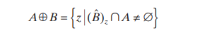

Адаптивна морфологична реконструкция на изображения
# Съдържание
[Увод	2](#_Toc124120089)

[Основни морфологични операции	2](#_Toc124120090)

[Морфологична реконструкция	4](#_Toc124120091)

[Недостатъци	4](#_Toc124120092)

[Предложение за адаптивност като решение	4](#_Toc124120093)

[Подход за реализация	5](#_Toc124120094)

[Резултати	5](#_Toc124120095)

[Странична бележка	5](#_Toc124120096)

[Ресурси	5](#_Toc124120097)

## Увод
Морфологичните трансформации се базират на работа с формите в изображения и като такива, помагат за постигане на резултати, свързани с откриване на конкретни форми, възстановяване и реконструиране на изображения. С помощта на простите операции като ерозия и дилатация и тяхното комбиниране се постигат различни резултати в областта на обработка на изображения. Това, на което по-подробно ще се спрем тук е именно сложната операция морфологична реконструкция, какви са нейните недостатъци и как да бъде подобрена, т.е. направена адаптивна. Един недостатък на морфологическата трансформация са че, понякога може да филтрира като излишни важни за даден алгоритъм локални минимуми и максимуми. Адаптивната реконструкция би се справяла по-добре с това понеже адаптивно филтрира ненужните сийд-ове докато запазва важните.
## Основни морфологични операции
Морфологичните операции, които ще разгледаме накратко са ни нужни за извършването на морфологична реконструкция. 

Oпределението за морфологични оператори съкратено представлява:

Морфологичните оператори са нелинейни оператори за съседство, дефинирано от структурен елемент. Структурния елемент съдържа стойности 0 или 1 в зависимост дали ще бъде включен или не даден пискел. Чрез проверка дали структурният елемент съответства или не на обекти, разглеждани като множество в n-мерното пространство се прилага обединение и/или сечение на множествата и оператори за максимум и минимум. [\[1\]](#_Ресурси)

Дилатацията (dilation) е операция, която експандира обекти в дадено изображение, като ако има поне един пиксел от обекта (foreground-a), то всички други пиксели в съседството му също стават от обекта. Така може 2 обекта да се свържат.

Където A - множеството точки пиксели на стартовото изображение и B - множеството точки пиксели на структурния елемент са от Z2  z-тата - стойностите на предните пикслеи (1-ци)и всички елементи на B през z се пресичат с поне един елемент на А.

Съответно ерозията (erosion) е операция, която „смалява“ обекти, като за всеки пиксел от обекта се определя дали да отиде към фона ако някой друг пискел в съседството му е от фона. Така може 2 обекта да се разделят. [\[4\]](#_Ресурси)

Където A - множеството точки пиксели на стартовото изображение и B - множеството точки пиксели на структурния елемент са от Z2, z-тата са стойностите на предните пикслеи (1-ци). Т.е. ерозията на А по B се състои от всички точки z, за които B през z се съдържа в A.

Геодезичната дилатация и ерозия се дефинират, като вече имаме 2 входни изображения. Маркер F, който задава стартовите точки на които се прилага дилатация и Маска G, която ограничава трансофрмацията. Отново имаме структурен Елемент B. Дефинираме рекурсивно геодезичната дилатация:

DG(1)F=(F⨁B)⋂G

DG(n)F=DG(1)DG(n-1)F

DG(0)F=F

За геодезичната ерозия имаме подобна дефиниция, като разликата е че не използваме дилатация а ерозия върху F към B и вместо сечение се прилага обединение:

EG(1)F=(F⊝B)⋃G

EG(n)F=EG(1)EG(n-1)F

EG(0)F=F

 
## Морфологична реконструкция
Ако започнем със същите начални условия – маркер изображение, маска и структурен елемент, морфологичната реконструкция всъщност представлява прогресивна дилатация (ако е дилатационна, с ерозионна е същото) на маркер изображението, докато се ограничава маркера да не надвишава стойностите на маската. Дилатацията се повтаря итеративно докато маркера вече не може да се променя повече без да надвиши маската – стабилизира се. Изхода от операцията е новополученото маркер изображение.  

RGDF=DG(k)F

Сама по себе си тя има много приложения в различни алгоритми като например  watershed transform and power watershed тъй като помага за филтрирането на локални екстремуми за да редуцира over-segmentation. Използва се също в Hysteresis thresholding за определяне на истински ръбове с помощта на 2 граници – ниска и висока. Съответно с това, може да се използва за Border-Clearing.  
## Недостатъци
Проблем на обикновената морфолгична реконструкция е, че се задава един предефиниран структурен елемент, който се прилага на към всички точки от маркера с първоначално определен размер. Така може на места да се получи прекалена сегментация, при опит да се разграничат с висока точност сегментите. Това е така, понеже е трудно едновременно да се премахнат излишни регионални минимуми докато се запазват значещи такива, като се има предвид структурен елемент от единствен мащаб.  
## Предложение за адаптивност като решение
Решението на този проблем логически идва в промяната при определяне на структурния елемент. Дефинирайки го на ниво пиксел, реконструкцията става адаптивна. Различни начини за определяне на структурния елемент са изследвани в последните години в научни трудове, тук ще се спрем на един. 

//Тука който си избера ще е

## Подход за реализация
За да се проверят резултатите с помощта на opencv, реализираме морфологическа реконструкция на изображения с единствен зададен структурен елемент, и с адаптивен такъв и сравняваме резултатите 

//Код
## Резултати
//Резултати от кода
## Странична бележка 
Случайно докато подготвях тази курсова работа ми попадна видео на реконструиран запис на първата [записана битка със снежни топки](https://www.youtube.com/watch?v=AjToVdbPxbw&ab_channel=OldenDays). За нея е използван алгоритъм базиран на GAN training - Generative adversarial networks. Там реализацията е с помощта на невронни мрежи но идеята е че има един генератор – който генерира данни да запълни липсващите участъци в дадено изображение и един дискриминатор – който да проверява дали генерираните данни са валидни и да ги изключва ако не са. Макар и изцяло различно, принципа на маркер който се експандира и маска която да го ограничава, звучи доста подобен макар и на по-ниско ниво. 
## Ресурси
1. Лекции към курса по обработка на изображения 
1. Интуитивно обяснение на морфологична реконструкция 

<https://www.youtube.com/watch?v=Y0yZ-BkxEDs&ab_channel=sinc>

1. Digital image Processing Fourth Edition by R. Gonzalez & R. Woods 

<https://intranet.fmi.uni-sofia.bg/index.php/s/DwkdD8nhfcjZ2TC?path=%2FBooks>

1. Е-книга на тема анализ на био изображения

<https://bioimagebook.github.io/chapters/2-processing/5-morph/morph.html>

1. Труд на тема адаптивна морфологическа реконструкция с матлаб

<https://arxiv.org/pdf/1904.03973.pdf>

1. Adaptive Tensor-Based Morphological Filtering and Analysis of 3D Profile Data by Anders Landström

<http://ltu.diva-portal.org/smash/get/diva2:999673/FULLTEXT01.pdf>

